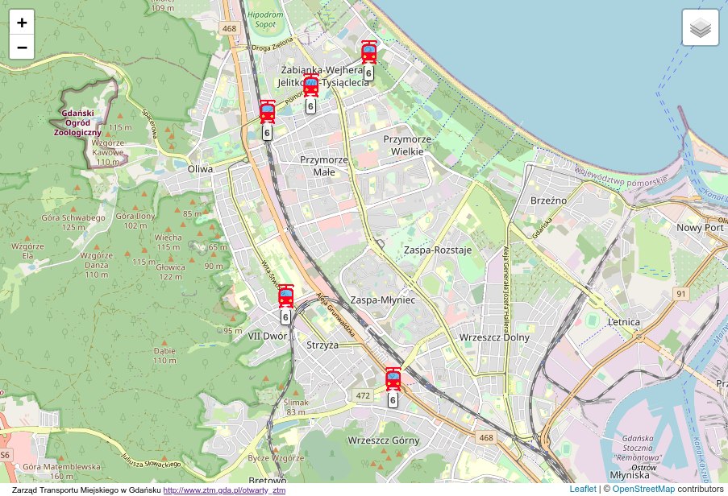
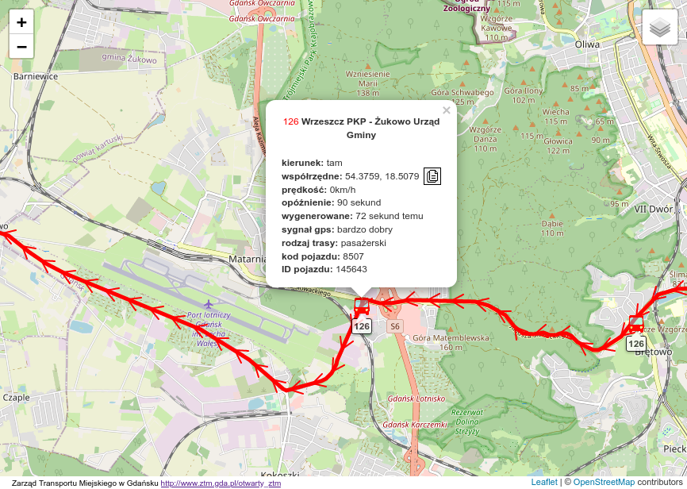
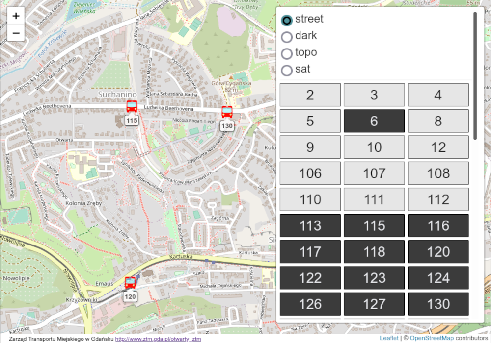

# ZTM
### web app for displaying position of Gdansk city buses and trams 🚌 🚊

app downloads data from Open Data ZTM in Gdańsk and displays it on the leaflet map  🗺

<a target="_blank" style="font-size:16px" href="https://ckan.multimediagdansk.pl/dataset/tristar">ztm open data webiste</a>

<a target="_blank" style="font-size:16px" href="https://leafletjs.com/">leaflet website</a>

#### languages and tools used:

  
  
  
  
  

#### to do:
* top bar with information
* time
* fix the one time download

#### recent done:
* async request
* attribution
* smootch update
* generated time better update
